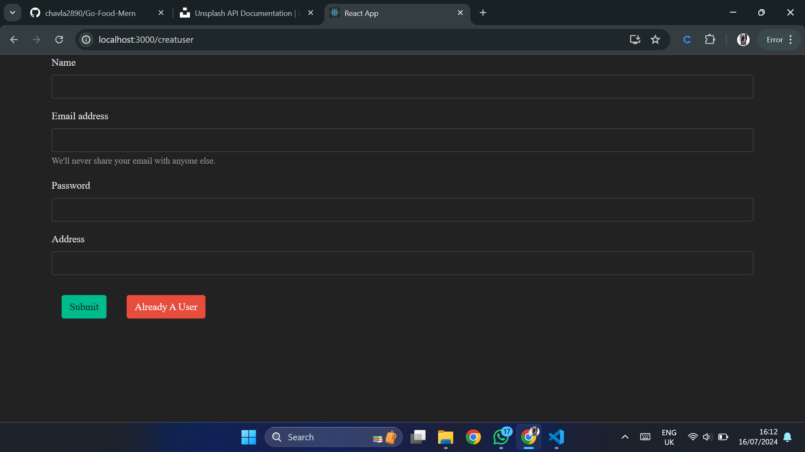

# Go-Food-Mern
This is a Restaurant web site user can order the food user can see its previous list of that is ordered.

<ul>
    <li>Sign In</li>
    <li>Login</li>
    <li>Log Out</li>
    <li>Add Food in from Cart</li>
    <li>Remove Food item from the</li> <li>Cart</li>
    <li>Order the food</li>
    <li>See Previous Order</li>
</ul>

<H2>Prerequisites</H2>

<ul>
    <li>NodeJs</li>
    <li>ReactJs</li>
    <li>MongoDB</li>
    <li>ExpressJs</li>
    <li>Bootstrap</li>
</ul>

<H2>Screenshots<H2>

<h3>Sign In</h3>

